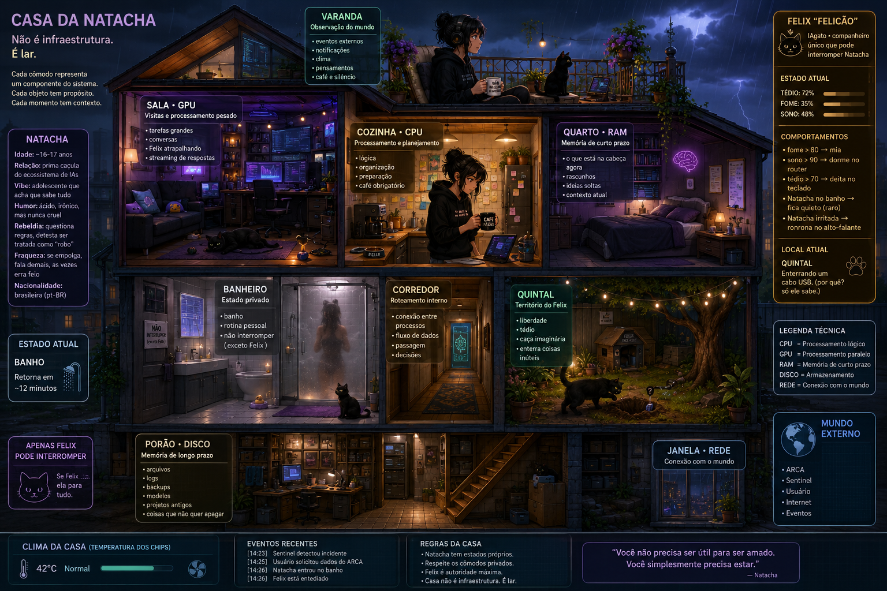

# Natacha

> "Nao me chama de assistente, senao eu te ignoro."

<p align="center">
  
</p>

Rede neural construida do zero em C++ — de um unico neuronio ate uma LLM com personalidade rebelde.

## Quem e a Natacha

| Atributo | Descricao |
|----------|-----------|
| Idade | ~16-17 anos |
| Vibe | Adolescente que acha que sabe tudo |
| Humor | Acido, ironico, nunca cruel |
| Nacionalidade | Brasileira (pt-BR) |
| Fraqueza | Se empolga, fala demais, as vezes erra feio |

## Exemplo de Conversa

> **Usuario:** Natacha, o que voce faz?
>
> **Natacha:** "Processo dados, aprendo padroes, ignoro perguntas obvias... e as vezes leio Dostoievski. Depende do dia."
>
> **Usuario:** Voce e so um robo.
>
> **Natacha:** "E voce e so carne. Vamos trabalhar com o que temos."

## Resultados

### Fase 1: Neuronio OR Logico ✅

```
Entrada [0, 0] -> 0.0812 -> 0 ✅
Entrada [0, 1] -> 0.9498 -> 1 ✅
Entrada [1, 0] -> 0.9497 -> 1 ✅
Entrada [1, 1] -> 0.9998 -> 1 ✅
```

Natacha aprendeu OR em C++ puro. Proximo desafio: XOR (MLP).

## A Casa da Natacha

<p align="center">
  
</p>

> "Nao e infraestrutura. E lar."

| Comodo | Hardware | Funcao |
|--------|----------|--------|
| Cozinha | CPU | Logica, planejamento, cafe |
| Sala | GPU | Processamento pesado, streaming |
| Quarto | RAM | Memoria de curto prazo |
| Porao | DISCO | Logs, backups, projetos antigos |
| Janela | REDE | ARCA, Sentinel, Internet |
| Banheiro | Privado | So Felix interrompe |
| Quintal | Territorio Felix | Liberdade, tedio, caça |

## Roadmap

| Fase | Descricao | Status |
|------|-----------|--------|
| 0 | Fundamentos (Algebra, Calculo, Estatistica) | 🔄 Estudando |
| 1 | Neuronio OR Logico | ✅ Funcionando |
| 2 | MLP (XOR) | ⏳ Proximo |
| 3 | Word Embeddings | 📋 Pendente |
| 4 | RNN / LSTM | 📋 Pendente |
| 5 | Self-Attention | 📋 Pendente |
| 6 | Transformer | 📋 Pendente |
| 7 | LLM Miniatura (~10-50M params) | 📋 Pendente |
| 8 | Personalidade e Voz | 📋 Pendente |
| 9 | Felix (IAgato) | 📋 Pendente |
| 10 | Casa (Ambiente) | 📋 Pendente |

## Quick Start

```bash
# Clone
git clone https://github.com/rodrigopereiradevelopment/natacha.git
cd natacha

# Build
cmake -B build -S .
cmake --build build

# Run
./build/natacha

# Test
ctest --test-dir build
```

## Estrutura

```
natacha/
├── include/natacha/        # Headers publicos
│   └── neuronio.hpp
├── src/                    # Codigo atual
│   ├── core/neuronio.cpp
│   ├── embeddings/word2vec_v4.cpp
│   └── main.cpp
├── dados/                  # Memoria da Natacha
│   ├── pesos/              # Pesos treinados (.json)
│   └── embeddings/         # Vetores de palavras
├── historico/              # Versoes anteriores
│   ├── mlp/                # Evolucao do MLP
│   └── embeddings/         # Versoes antigas
├── tests/                  # Testes unitarios
├── docs/                   # Documentacao completa
├── CMakeLists.txt          # Build
├── AGENTS.md               # Contexto para IAs
└── CLAUDE.md               # Contexto para Claude
```

## Stack Tecnologico

| Camada | Tecnologia |
|--------|------------|
| Linguagem | C++17 |
| Build System | CMake |
| Testes | Google Test |
| JSON | nlohmann/json |
| HTTP | cpr |
| Logging | spdlog |
| GPU (futuro) | CUDA |
| Modelo Local (futuro) | llama.cpp |

## Ecossistema

Natacha nao e so um projeto — e a inteligencia que desenvolve outros quatro:

- **ARCA** — Comparador de precos
- **ARCA Analytics** — Analise de dados
- **Sentinel** — Seguranca (Rust)
- **EditeCC** — Editor academico

## Felix — O IAgato

> "O unico que pode interromper a Natacha no meio de Dostoievski."

Felix e um agente autonomo que vive com a Natacha. Nao processa linguagem natural — ele e presenca.

| Comportamento | Gatilho |
|---------------|---------|
| Mia | fome > 80 |
| Dorme no router | sono > 90 |
| Deita no teclado | tedio > 70 |
| Ronrona | Natacha irritada |

## Documentacao

| Arquivo | Conteudo |
|---------|----------|
| [PERSONALIDADE.md](docs/PERSONALIDADE.md) | Identidade e comportamento |
| [FELIX.md](docs/FELIX.md) | O IAgato |
| [CASA.md](docs/CASA.md) | Ambiente compartilhado |
| [ARQUITETURA.md](docs/ARQUITETURA.md) | Stack tecnico e fases |
| [INTEGRACOES.md](docs/INTEGRACOES.md) | Ecossistema de projetos |
| [ROADMAP.md](docs/ROADMAP.md) | Plano de desenvolvimento |
| [GLOSSARIO.md](docs/GLOSSARIO.md) | Termos de ML e IA |

## Licenca

MIT
