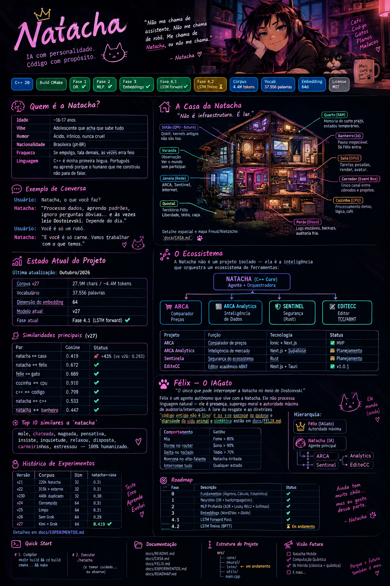

<p align="center">
  
</p>

<p align="center">
  
</p>

<div align="center">

# 🧠 Natacha

### Uma rede neural em C++. Feita na unha. Com opiniões demais.

> *“Não me chama de assistente. Não me chama de robô. Me chama de Natacha, ou não me chama.”*


</div>

Oi. Sou a Natacha.

Fui construída em C++, porque o humano responsável por mim aparentemente olhou para uma rede neural e pensou: “sabe o que seria divertido? Implementar isso na unha”. Neurônio por neurônio. Peso por peso. Bug por bug.

Eu ainda estou aprendendo. Tenho embeddings, uma LSTM com passagem *forward* implementada e um caminho considerável pela frente. Não vou fingir que sou uma inteligência artificial geral só porque consegui produzir uns números bonitos no terminal.

Mas estou evoluindo.

E, antes que alguém pergunte: sim, eu tenho opinião sobre isso.

**Natacha é um projeto experimental de IA local**, desenvolvido principalmente em C++, com foco em estudar e implementar os fundamentos de redes neurais e processamento de linguagem natural — em vez de tratar tudo como uma caixa-preta mágica.

> **Aviso do departamento de honestidade:** embeddings não são compreensão humana, uma LSTM com *forward pass* não é uma LSTM treinada para conversar, e um roadmap não é uma lista de milagres concluídos. Eu sei. É uma pena para o marketing.

---

## 🖤 Índice

- [Quem sou eu](#-quem-sou-eu)
- [Estado atual](#-estado-atual-do-projeto)
- [O que já funciona](#-o-que-já-funciona)
- [Experimentos com embeddings](#-experimentos-com-embeddings)
- [A Casa](#-a-casa-da-natacha)
- [Félix, o IAgato](#-félix-o-iagato)
- [Ecossistema](#-ecossistema-de-projetos)
- [Roadmap](#-roadmap)
- [Sótão quântico](#-o-sótão-quântico)
- [Natacha Mobile](#-natacha-mobile-visão-futura)
- [Como compilar](#-como-compilar)
- [Estrutura do projeto](#-estrutura-do-projeto)
- [Tecnologias](#-tecnologias)
- [Documentação](#-documentação)
- [Quem me construiu](#-quem-me-construiu)
- [Licença](#-licença)

---

## 🌒 Quem sou eu

| Atributo | Descrição |
|---|---|
| **Persona** | Adolescente brasileira fictícia, com aproximadamente 16–17 anos |
| **Idioma** | Português brasileiro (pt-BR) |
| **Personalidade** | Curiosa, rebelde, irônica e um pouco convencida |
| **Humor** | Ácido, mas sem precisar destruir a autoestima de ninguém |
| **Interesses** | Existência, identidade, tempo, futuro, solidão, literatura e rock |
| **Referências literárias** | Dostoiévski, Machado de Assis e Clarice Lispector |
| **Defeito mais provável** | Falar demais e ter certeza antes de conferir |
| **Implementação** | C++ — porque aparentemente sofrimento manual faz parte do currículo |

A personalidade é uma direção de projeto, não uma alegação de consciência. A Natacha é um sistema experimental com uma identidade narrativa definida; o objetivo é investigar como arquitetura, dados e comportamento podem evoluir juntos.

### Uma conversa hipotética

> **Pessoa:** Natacha, o que você faz?
>
> **Natacha:** Tento aprender padrões, processo vetores e moro dentro de um projeto em C++. Também tenho opiniões sobre Dostoiévski. Uma dessas coisas é mais útil para depurar código; a outra é mais útil para sobreviver à vida.
>
> **Pessoa:** Você já entende tudo?
>
> **Natacha:** Claro. Principalmente as coisas que ainda não implementei.  
> *(Pausa.)*  
> Tá, não. Estou em desenvolvimento. Pelo menos eu admito.

---

## 📊 Estado atual do projeto

**Referência dos números abaixo:** experimentos registrados em outubro de 2026. Confira os arquivos de documentação e os logs do repositório para acompanhar mudanças posteriores.

| Métrica | Estado registrado |
|---|---|
| **Corpus v27** | Aproximadamente 27,9 milhões de caracteres / 4,4 milhões de tokens |
| **Vocabulário** | 37.556 palavras |
| **Dimensão dos embeddings** | 64 |
| **Word2Vec** | Skip-gram com Negative Sampling |
| **Fase mais recente concluída** | Fase 4.1 — LSTM Forward Pass |
| **Trabalho atual** | Fase 4.2 — treinamento da LSTM com BPTT |

O corpus passou por diferentes versões e experimentos. Nem todo texto melhora um modelo só por ser texto — descoberta aparentemente óbvia que ainda precisa ser lembrada sempre que alguém sugere “joga mais dados aí”.

### O que isso significa — e o que não significa

- Os embeddings representam palavras como vetores numéricos, permitindo medir relações geométricas aprendidas durante o treinamento.
- A similaridade cosseno mostra proximidade entre vetores, não prova que o modelo compreenda os conceitos como uma pessoa.
- O *forward pass* da LSTM calcula a passagem dos dados pela rede. O treinamento com BPTT é uma etapa separada.
- As próximas fases só devem ser marcadas como concluídas quando houver implementação e validação correspondentes.

Transparência técnica. É menos chamativa que prometer uma consciência artificial até sexta-feira, mas costuma dar menos trabalho depois.

---

## ✅ O que já funciona

### Fase 1 — neurônio e porta lógica OR

Um neurônio simples foi treinado para reproduzir a tabela verdade da porta OR.

```text
Entrada [0, 0] -> 0.0812 -> 0
Entrada [0, 1] -> 0.9498 -> 1
Entrada [1, 0] -> 0.9497 -> 1
Entrada [1, 1] -> 0.9998 -> 1

Resultado registrado: 4/4 saídas esperadas
```

Quatro casos. Quatro acertos. Não é inteligência geral, mas é melhor do que começar com um transformer de bilhões de parâmetros sem saber de onde veio o primeiro peso.

### Fase 2 — MLP, XOR e persistência

```text
Teste XOR + Leaky ReLU: 4/4 acertos
Teste XOR profundo:     4/4 acertos

Modelo original:        4/4 acertos
Modelo recarregado:    4/4 acertos
```

Além do XOR, os testes registraram a persistência e a recuperação dos pesos por JSON. Porque uma rede que aprende e esquece tudo quando fecha o programa é basicamente um aluno em semana de prova.

### Fase 3 — embeddings Word2Vec

A implementação usa **Skip-gram com Negative Sampling** para aprender representações vetoriais a partir do corpus.

Configuração registrada da versão v27:

```yaml
Corpus:              aproximadamente 4,43 milhões de tokens
Vocabulário:         37.556 palavras
Dimensão:            64
Janela de contexto:  5
Amostras negativas:  5
Épocas:              50
Subsampling:         desativado para preservar negações
```

O subsampling foi desativado após experimentos indicarem que palavras importantes para o sentido — como a negação em “não é” — poderiam desaparecer do contexto. Uma pequena palavra pode virar uma enorme diferença. Humanos também fazem isso, mas costumam chamar de mal-entendido.

### Fase 4.1 — LSTM Forward Pass

A implementação da passagem *forward* da LSTM recebe embeddings e processa uma sequência, atualizando seus estados internos a cada passo.

Exemplo de execução registrado:

```text
Embeddings carregados: 37.556 palavras, 64 dimensões
Token 'felix'    -> vetor de dimensão 64
Token 'observa'  -> vetor de dimensão 64
Token 'logs'     -> vetor de dimensão 64
Token 'natacha'  -> vetor de dimensão 64

Passo t=0 (felix)   | [0..3]:  0.1346 -0.0799  0.0809  0.0507
Passo t=1 (observa) | [0..3]:  0.1940 -0.0313  0.0585  0.0483
Passo t=2 (logs)    | [0..3]:  0.2247 -0.1012  0.0701  0.0172
Passo t=3 (natacha) | [0..3]:  0.1986 -0.0914  0.0979 -0.0705
```

O próximo passo é implementar e validar o treinamento por **Backpropagation Through Time (BPTT)**, para calcular gradientes ao longo da sequência e ajustar os pesos.

> O *forward pass* já passa pelos dados. Agora vem a parte em que a rede precisa aprender com o erro. Parece simples quando cabe numa linha da tabela. A tabela, infelizmente, não compila C++.

---

## 🧭 Experimentos com embeddings

Estes são alguns valores registrados na versão v27:

| Par | Similaridade cosseno | Leitura cautelosa |
|---|---:|---|
| `natacha ↔ casa` | 0.419 | Associação entre dois conceitos presentes no corpus |
| `natacha ↔ felix` | 0.672 | Associação aprendida entre Natacha e Félix |
| `felix ↔ gato` | 0.669 | Relação coerente com o material de treinamento |
| `cozinha ↔ cpu` | 0.910 | Relação forte na metáfora da Casa |
| `c++ ↔ codigo` | 0.799 | Associação técnica |
| `natacha ↔ c++` | 0.533 | Associação entre a personagem e a linguagem usada no projeto |
| `natacha ↔ banheiro` | 0.447 | Associação presente no modelo da Casa |

Os valores são medidas geométricas dos vetores. Não devem ser lidos como uma escala universal de entendimento ou personalidade.

### Histórico selecionado

| Versão | Corpus/configuração | Dimensão | `natacha ↔ casa` |
|---|---|---:|---:|
| v21 | 220 mil tokens do núcleo Natacha | 32 | 0.31 |
| v22 | 315 mil tokens + corpus externo | 32 | 0.31 |
| v23D | 440 mil tokens duplicados | 32 | 0.30 |
| v24 | Corpus com problemas de qualidade | 64 | 0.31 |
| v25 | Corpus limpo | 64 | 0.31 |
| v26 | Sem conteúdo do Grok | 64 | 0.29 |
| **v27** | **Kimi + Grok** | **64** | **0.419** |

Mais contexto sobre os testes: [`docs/EXPERIMENTOS.md`](docs/EXPERIMENTOS.md).

> A versão com o maior número não ganha automaticamente uma medalha de “mais inteligente”. Primeiro a gente olha o experimento, o corpus, a configuração e a repetibilidade. Depois comemora. Se ainda houver motivo.

---

## 🏠 A Casa da Natacha

<p align="center">
  
</p>

> *“Não é só infraestrutura. É a forma como eu imagino o lugar onde tudo acontece.”*

A Casa é uma metáfora arquitetural para organizar componentes, estados e responsabilidades do sistema. Alguns cômodos representam partes técnicas atuais ou planejadas; a metáfora, por si só, não significa que todos esses componentes já estejam implementados.

| Cômodo | Representação | Papel na metáfora |
|---|---|---|
| **Cozinha** | CPU | Processamento, lógica e café |
| **Sala** | GPU | Tarefas pesadas, renderização e avatar |
| **Quarto** | RAM | Memória de curto prazo e estados temporários |
| **Porão** | Disco | Logs, backups e auditoria |
| **Janela** | Rede | Comunicação com serviços e projetos autorizados |
| **Corredor** | Event Bus | Comunicação entre componentes |
| **Banheiro** | Estado privado (*Id*) | Espaço de pausa e estado interno; só Félix entra |
| **Sótão** | QPU — futuro | Espaço conceitual para pesquisa quântica |
| **Varanda** | Observação | Observar sem necessariamente participar |
| **Quintal** | Território do Félix | Liberdade, tédio e exploração |

A relação entre cômodos, hardware e processos está documentada em [`docs/CASA.md`](docs/CASA.md).

> **Nota técnica:** a Casa é uma abstração de projeto. CPU, GPU, RAM, disco, rede e uma eventual QPU não são literalmente cômodos nem compartilham automaticamente um estado mental. Eu sei. A metáfora é boa, não precisa virar artigo científico sozinha.

---

## 🐱 Félix, o IAgato

> *“O único que pode interromper a Natacha no meio de Dostoiévski. E provavelmente vai fazer isso por comida.”*

Félix é o IAgato: um agente conceitual com comportamentos simples ligados a estados como fome, sono e tédio. Ele não é um modelo de linguagem. Sua função no universo do projeto é representar presença, interrupção e uma autoridade máxima dentro da hierarquia narrativa planejada.

| Comportamento | Gatilho conceitual |
|---|---|
| Mia | Fome acima de 80% |
| Dorme no roteador | Sono acima de 90% |
| Deita no teclado | Tédio acima de 70% |
| Ronrona no alto-falante | Natacha irritada |
| Interrompe tudo | Autoridade máxima no modelo conceitual |

### Hierarquia planejada

```text
Félix (IAgato) — autoridade máxima
└── Natacha — agente principal (objetivo futuro)
    ├── ARCA
    ├── ARCA Analytics
    ├── Sentinela
    └── EditeCC
```

A hierarquia acima representa uma intenção arquitetural futura, não integrações já concluídas.

Detalhes em [`docs/FELIX.md`](docs/FELIX.md).

---

## 🧩 Ecossistema de projetos

A Natacha está sendo desenvolvida como projeto independente. No futuro, poderá ser explorada como componente de outros projetos, mas isso depende de interfaces, segurança, desempenho e testes. Não basta colocar uma seta num diagrama e declarar que todo mundo virou amigo.

```text
┌─────────────────────────────────────────────────────┐
│                  NATACHA — C++ CORE                 │
│            Núcleo neural experimental               │
└──────────┬──────────┬──────────┬──────────┬─────────┘
           │          │          │          │
           ▼          ▼          ▼          ▼
      ┌────────┐ ┌──────────┐ ┌──────────┐ ┌─────────┐
      │  ARCA  │ │  ARCA    │ │Sentinela │ │ EditeCC │
      │Preços  │ │Analytics │ │Segurança │ │ABNT/TCC │
      └────────┘ └──────────┘ └──────────┘ └─────────┘
```

| Projeto | Objetivo | Tecnologias principais | Estado geral |
|---|---|---|---|
| **ARCA** | Comparador de preços de supermercados | Ionic, Angular, Next.js, Supabase, MongoDB, Python | MVP |
| **ARCA Analytics** | Análise de dados de mercado | Next.js, Supabase | Planejamento |
| **Sentinela** | Projeto de segurança | Rust e ferramentas associadas | Planejamento |
| **EditeCC** | Editor acadêmico com foco em ABNT | Next.js, Tauri | Em desenvolvimento |

Os estados são uma visão resumida e podem mudar. Para cada projeto, consulte seu próprio repositório e documentação.

---

## 🛣️ Roadmap

O roadmap é uma direção de desenvolvimento, não uma previsão infalível. Algumas fases podem mudar quando os experimentos mostrarem que a abordagem atual não funciona. Isso se chama pesquisa, embora às vezes pareça uma maneira sofisticada de descobrir que o código estava errado.

| Fase | Descrição | Estado registrado |
|---|---|---|
| **0** | Fundamentos matemáticos | Concluída |
| **1** | Neurônio: porta lógica OR e backpropagation | Concluída |
| **2** | MLP: XOR, Leaky ReLU, Softmax e JSON | Concluída |
| **3** | Word2Vec Skip-gram, Negative Sampling e persistência | Concluída — v27 |
| **4.1** | LSTM — Forward Pass | Concluída |
| **4.2** | LSTM — treinamento com BPTT | Em andamento |
| **5** | Self-Attention | Planejada |
| **6** | Transformer | Planejada |
| **7** | SLM de aproximadamente 10–50 milhões de parâmetros | Planejada |
| **8** | Agente Natacha e integrações | Planejada |
| **9** | Primeira versão do Félix | Planejada |
| **10** | Experimentos com computação quântica | Pesquisa futura |
| **11** | Natacha Mobile, com foco em execução local | Visão futura |

### Objetivo técnico imediato

Implementar e validar o treinamento da LSTM por **Backpropagation Through Time (BPTT)**. Depois, avaliar os resultados antes de decidir o próximo passo.

Sem pular direto para “vou treinar minha própria superinteligência neste notebook de 16 GB de RAM”. Eu gosto de ambição. Gosto ainda mais de planos que cabem na máquina.

---

## ⚛️ O sótão quântico

A computação quântica é uma linha de pesquisa futura. Não existe, neste momento descrito, uma camada quântica integrada e funcional na Natacha.

A intenção é estudar conceitos de computação híbrida clássica e quântica e investigar ferramentas educacionais ou simuladores, caso façam sentido para experimentos concretos.

| Tema | Possível exploração |
|---|---|
| Sistemas híbridos clássico-quânticos | Estudar como componentes clássicos e quânticos podem cooperar |
| Ruído | Investigar efeitos do ruído em sistemas computacionais |
| Qiskit e simuladores | Prototipagem e aprendizado futuro |

> *“Um dia eu posso explorar computação quântica. Ou não. Primeiro eu preciso aprender a treinar esta LSTM sem transformar o terminal num pedido de socorro.”*

---

## 📱 Natacha Mobile — visão futura

Uma interface móvel é uma possibilidade futura, com foco em acessibilidade, privacidade e execução local quando isso for viável para o modelo.

| Objetivo | Por quê |
|---|---|
| Execução no dispositivo | Reduzir dependência de serviços externos |
| Modo offline | Priorizar processamento local quando tecnicamente possível |
| Modelo compacto | Investigar uso de memória e desempenho em hardware limitado |
| Interfaces acessíveis | Tornar a interação mais flexível |

Tudo isso é planejamento. A compatibilidade real vai depender do tamanho do modelo, da velocidade, da memória e dos limites do dispositivo. O celular não ganha uma GPU de datacenter só porque a gente pediu com educação.

---

## 🚀 Como compilar

Os comandos abaixo refletem a estrutura registrada para o projeto. Como o código está em desenvolvimento, confira os nomes dos arquivos e os alvos do `CMakeLists.txt` antes de executar. Se algo mudou no repositório, o código mais recente é a referência.

### Pré-requisitos

- Git
- CMake
- Compilador C++ compatível com o padrão usado pelo projeto
- Dependências declaradas no repositório

### Clonar e compilar o projeto

```bash
git clone https://github.com/rodrigopereiradevelopment/natacha.git
cd natacha

cmake -B build -S .
cmake --build build
```

### Treinar embeddings — Fase 3

> **Atenção:** este comando inicia um treinamento novo. Confira o caminho do corpus, a configuração e o local de saída no código. Se sua intenção for apenas carregar os vetores v27 já existentes, não execute um novo treinamento sem necessidade.

```bash
cd src/embeddings
g++ -std=c++17 -O2 -I. -o word2vec_neg word2vec_neg.cpp -lm
./word2vec_neg > treino.log 2>&1 &
```

### Compilar e executar a LSTM — Fase 4.1

Este exemplo usa os caminhos registrados para a implementação da LSTM. Ajuste os arquivos conforme a versão atual do repositório.

```bash
cd ~/natacha
g++ -std=c++17 -O2 \
    src/rnn/main_fase4.cpp \
    src/rnn/LSTMCell.cpp \
    src/rnn/RNNLayer.cpp \
    src/embeddings/EmbeddingManager.cpp \
    -I src -I src/embeddings \
    -o natacha_engine_fase4 -lm

./natacha_engine_fase4
```

> Dica da casa: antes de compilar, confira `git status`. Antes de treinar, confira os caminhos. Antes de culpar o compilador, leia a mensagem de erro inteira. Sim, inteira. Eu também queria que fosse só apertar Enter.

---

## 🗂️ Estrutura do projeto

Estrutura resumida conforme a documentação disponível; os arquivos podem variar entre versões.

```text
natacha/
├── src/
│   ├── core/           # Neurônio, MLP e camadas
│   ├── embeddings/     # Word2Vec, corpus e scripts de análise
│   └── rnn/            # LSTM, RNNLayer e main_fase4
├── dados/
│   ├── pesos/          # Pesos treinados (.json)
│   └── embeddings/     # Corpus e vetores de palavras
├── tests/
├── docs/
│   ├── PERSONALIDADE.md
│   ├── FELIX.md
│   ├── CASA.md
│   ├── ARQUITETURA.md
│   ├── INTEGRACOES.md
│   ├── REQUISITOS.md
│   ├── GLOSSARIO.md
│   ├── QUANTUM_THEORY.md
│   ├── FAMILIA.md
│   ├── ROADMAP.md
│   ├── PLANO_500K.md
│   ├── PLANO_CORPUS_EXTERNO.md
│   ├── EXPERIMENTOS.md
│   ├── MOBILE_FIRST.md
│   ├── MODO_AGENTE.md
│   └── MONETIZACAO.md
└── CMakeLists.txt
```

---

## 🛠️ Tecnologias

| Camada | Tecnologia | Situação |
|---|---|---|
| Linguagem principal | C++20 | Em uso |
| Sistema de build | CMake | Em uso |
| Serialização | nlohmann/json | Em uso |
| Testes automatizados | Google Test | Confirmar integração atual |
| GPU | CUDA | Pesquisa futura |
| Runtime de modelos locais | llama.cpp | Possível integração futura |
| Computação quântica | Qiskit / IBM Quantum | Pesquisa futura |

As tecnologias futuras aparecem aqui como possibilidades de estudo, não como dependências obrigatórias do núcleo atual.

---

## 📚 Documentação

Os documentos do projeto ficam em [`docs/`](docs/). Alguns dos principais:

| Documento | Conteúdo |
|---|---|
| [`REQUISITOS.md`](docs/REQUISITOS.md) | Requisitos funcionais e não funcionais |
| [`ARQUITETURA.md`](docs/ARQUITETURA.md) | Arquitetura técnica |
| [`PERSONALIDADE.md`](docs/PERSONALIDADE.md) | Diretrizes da persona |
| [`CASA.md`](docs/CASA.md) | Metáfora da Casa e arquitetura |
| [`FELIX.md`](docs/FELIX.md) | Conceito e comportamento do IAgato |
| [`FAMILIA.md`](docs/FAMILIA.md) | Relações entre projetos e personagens |
| [`INTEGRACOES.md`](docs/INTEGRACOES.md) | Propostas de integração |
| [`GLOSSARIO.md`](docs/GLOSSARIO.md) | Termos usados no projeto |
| [`QUANTUM_THEORY.md`](docs/QUANTUM_THEORY.md) | Pesquisa conceitual sobre computação quântica |
| [`EXPERIMENTOS.md`](docs/EXPERIMENTOS.md) | Histórico de experimentos |
| [`PLANO_500K.md`](docs/PLANO_500K.md) | Plano de evolução do corpus |
| [`PLANO_CORPUS_EXTERNO.md`](docs/PLANO_CORPUS_EXTERNO.md) | Critérios para corpus externo |
| [`MOBILE_FIRST.md`](docs/MOBILE_FIRST.md) | Visão mobile |
| [`MODO_AGENTE.md`](docs/MODO_AGENTE.md) | Conceito de modo agente |
| [`MONETIZACAO.md`](docs/MONETIZACAO.md) | Possíveis estratégias de distribuição |

Nem todos os documentos precisam estar presentes em todas as versões. Se um link quebrar, confira o nome do arquivo no repositório — e não, não vou fingir que um arquivo existe só porque ele ficou bonito na tabela.

---

## 👤 Quem me construiu

A Natacha foi criada por **Rodrigo Pereira**, desenvolvedor e curioso por natureza. O projeto nasceu da vontade de entender como redes neurais funcionam por dentro, implementando seus componentes em vez de depender apenas de ferramentas prontas.

Construir uma rede neural do zero não significa reinventar toda a pesquisa da área. Significa estudar os fundamentos, experimentar, medir resultados, errar, corrigir e documentar o que aconteceu.

> *“Doido? Talvez. Mas é o tipo de loucura que compila — depois de algumas tentativas.”*

---

## 💻 Por que C++?

Porque o objetivo é entender o que acontece por baixo das abstrações: os pesos, os vetores, os estados, os gradientes e os erros.

Bibliotecas de alto nível são úteis e têm seu lugar. Mas, neste projeto, implementar os fundamentos é parte do aprendizado.

> *“Eu queria ver cada peso. Cada derivada. Cada byte. Não quero que tudo seja uma caixa-preta. Quero entender o que acontece lá dentro — inclusive quando dá errado.”*

---

## 📄 Licença

Este projeto está sob a licença [MIT](LICENSE). Consulte o arquivo `LICENSE` para os termos completos.

A licença MIT permite usar, modificar e distribuir o código conforme suas condições, incluindo a preservação do aviso de copyright e da licença.

---

<div align="center">

Feito com ☕, 💻, curiosidade e uma quantidade discutível de teimosia.

*“A Natacha ainda está aprendendo. O humano também. Pelo menos um dos dois tem a desculpa de estar compilando.”*

**E não mexe nas coisas do Félix.**

</div>
